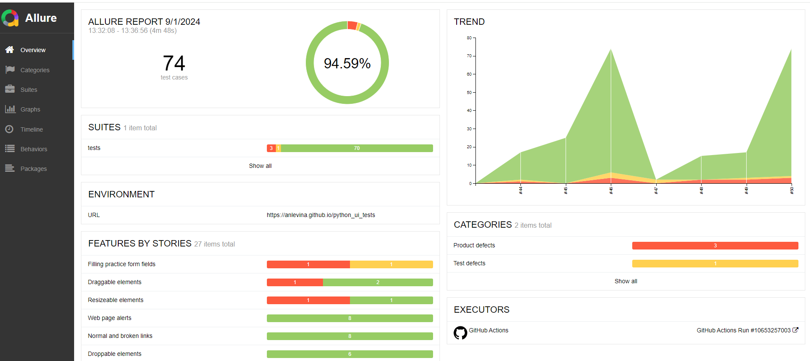

# Python UI autotesting project

This project covers with UI tests the website https://demoqa.com/

The project was created  to demonstrate proficiency in handling various web elements and browser logic. Naturally, in real projects, comprehensive UI tests should cover predefined flows.
Some tests in the project work better when run locally. If you want to run the project locally, please use the following command:
> pytest -s -m
> 
And the following commands if you want to generate a report locally:

> pytest --alluredir="allure_results"
> 
> allure serve allure_results

## Tools:
- Pytest (PyCharm)
- Allure
- GitHub (GitHub Actions, GitHub Pages)

## Allure report
Click <a href="https://anlevina.github.io/python_ui_tests/50/">here</a> to open example of allure report.

  

